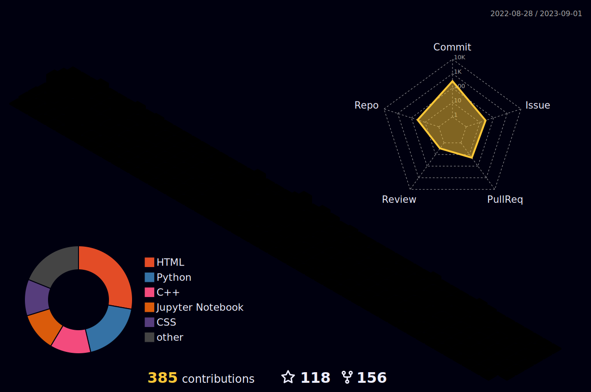

<h1 align = "center">Hi, Everyone!!  </h1>

 

 
 

## <picture>   </picture> About me
<picture> </picture>
- 🏫 I am a 3rd year CSE Student at [`Lovely Professional University`](https://www.lpu.in).
- 🧑‍💻 Love Coding in C and C++ mostly.
- 🙂 Open Source Contributor at [`GSSoC'22`](https://gssoc.girlscript.tech/).
- ⭐ Secured 46th Rank Globally & Received `Letter of Recommendation` in [`GSSoC'22`](https://gssoc.girlscript.tech/).
- ⭐ 3rd Milestone in [`GoogleCloudReady Facilitator Program'22`](https://events.withgoogle.com/googlecloudready-facilitator-program/).
- 🙂 Contributor & Project Admin at [`HSOC'22`](https://soc.hackclubrait.co/).
- ⭐ Secured 6th Rank Globally in [`HSOC'22`](https://soc.hackclubrait.co/).
- 🙂 Contributor & Project Maintainer at [`Hacktoberfest'22`](https://hacktoberfest.com/).
- ⭐ 9 PRs merged in [`Hacktoberfest'22`](https://hacktoberfest.com/).
- 🤓 Always in a try to `learn new things`.

<table align = "center">
  <tr>
    <td align = "center"> 🌟 Web Development & Designing Intern at <a href = "https://oasisinfobyte.com/"> Oasis Infobyte</a>  in October'22 </td>
    <td align = "center"> 🌟 Web Development Intern at <a href = "https://internship.thesparksfoundation.info/"> The Sparks Foundation</a>  in October'22, <b>Received LOR</b> </td>
    <td align = "center"> 💻 Campus Ambassador Intern at <a href = "https://internbug.wixsite.com/internbug"> InternBug</a>  in October'22 </td>
    <td align = "center"> 🌟 Web Development Intern at <a href = "https://codeclause.com/"> CodeClause</a>  in December'22, <b>Received LOR</b> </td>
    <td align = "center"> 🌟 Web Developer Intern at <a href = "https://letsgrowmore.in/"> LetsGrowMore</a>  in December'22, <b>Received LOR</b> </td>
</td>
  </tr>
</table>

 
 

## 🚀 Preferred Programming Languages and Tools:

	<code></code>
    	<code></code>
    	<code></code>
    	<code></code>
    	<code></code>
	<code></code>
	<code></code>
    	<code></code>
	<code></code>
	<code></code>

 

## 👨🏻‍💻 Coding Profiles

 

## 👨‍💻 Open Source Contributions
| S.No. | Open Source Programs | Duration | Role | Rewards |
|:-----:|:-----:|:-----:|:-----:|:-----:|
| 1. | GirlScript Summer of Code | 1st Mar - 31st May 2022 | Contributor | 1. [Certificate & LOR](https://www.linkedin.com/posts/rakesh-roshan-9100_gssoc-top-performer-activity-6962652421214908416-pdZg?utm_source=share&utm_medium=member_desktop)  2. [Swags](https://www.linkedin.com/posts/rakesh-roshan-9100_opensource-program-contributor-activity-6994604804513673216-CJfE?utm_source=share&utm_medium=member_desktop) |
| 2. | Hack Club RAIT Summer Of Code| 15th July - 30th August 2022 | Contributor | [Certificate](https://drive.google.com/file/d/167zbwHjw_m7LPksIG2JNu4XO4WHEugSe/view?usp=share_link) |
| 3. | Hack Club RAIT Summer Of Code| 15th July - 30th August 2022 | Project Admin | [Certificate](https://drive.google.com/file/d/1L3K9xfyJ1rj0kSA-Vc0P6hlodb6FWAKO/view?usp=share_link) |
| 4. | Hacktoberfest | 1st October - 31st October 2022 | Contributor | [T-Shirt & Stickers](https://www.linkedin.com/posts/rakesh-roshan-9100_hacktoberfest2022-hacktoberfest-github-activity-7025102004079239169-PYOP?utm_source=share&utm_medium=member_desktop) |
| 5. | Hacktoberfest | 1st October - 31st October 2022 | Project Admin | [T-Shirt & Stickers](https://www.linkedin.com/posts/rakesh-roshan-9100_hacktoberfest2022-hacktoberfest-github-activity-7025102004079239169-PYOP?utm_source=share&utm_medium=member_desktop) |
 

## 🔗 Connect with me:

 
 

## <picture>   </picture> My Github Stats

<h3>🔥 Streak Stats</h3>

  

<h3>💻 GitHub Profile Stats</h3>

  
<b>Note:</b> Top languages is only a metric of the languages my public code consists of and doesn't reflect experience or skill level.

<h3>⚡ Recent GitHub Activity</h3>

<!--START_SECTION:activity-->
`[02/28 18:06]`  Deleted `main` from [Rakesh9100/EnlightenHeavens](https://github.com/Rakesh9100/EnlightenHeavens)  
`[02/28 17:50]`  Made `2` commits in [Rakesh9100/EnlightenHeavens](https://github.com/Rakesh9100/EnlightenHeavens)  
`[02/28 17:40]`  Commented on [`#85`](https://github.com//Rakesh9100/Click-The-Edible-Game/issues/85 'made changes for the UI ') in [Rakesh9100/Click-The-Edible-Game](https://github.com/Rakesh9100/Click-The-Edible-Game)  
`[02/28 17:18]`  Created branch [`gh-pages`](https://github.com/Rakesh9100/EnlightenHeavens/tree/gh-pages) in [Rakesh9100/EnlightenHeavens](https://github.com/Rakesh9100/EnlightenHeavens)  
`[02/28 17:17]`  Created branch [`main`](https://github.com/Rakesh9100/EnlightenHeavens/tree/main) in [Rakesh9100/EnlightenHeavens](https://github.com/Rakesh9100/EnlightenHeavens)  

<b> ⚙️ Show Older Activity</b>

`[02/28 17:17]`  Created repository [Rakesh9100/EnlightenHeavens](https://github.com/Rakesh9100/EnlightenHeavens)  
`[02/28 17:03]`  Created repository [Rakesh9100/TestWordpress](https://github.com/Rakesh9100/TestWordpress)  
`[02/28 16:54]`  Made `1` commit in [Rakesh9100/Test](https://github.com/Rakesh9100/Test)  
`[02/28 16:50]`  Created branch [`main`](https://github.com/Rakesh9100/Test/tree/main) in [Rakesh9100/Test](https://github.com/Rakesh9100/Test)  
`[02/28 16:50]`  Created repository [Rakesh9100/Test](https://github.com/Rakesh9100/Test)  
`[02/28 16:49]`  Commented on [`#85`](https://github.com//Rakesh9100/Click-The-Edible-Game/issues/85 'made changes for the UI ') in [Rakesh9100/Click-The-Edible-Game](https://github.com/Rakesh9100/Click-The-Edible-Game)  
`[02/28 15:34]`  Commented on [`#29`](https://github.com//Rakesh9100/Click-The-Edible-Game/issues/29 'A scroll down should be added ') in [Rakesh9100/Click-The-Edible-Game](https://github.com/Rakesh9100/Click-The-Edible-Game)  
`[02/28 15:28]`  Commented on [`#29`](https://github.com//Rakesh9100/Click-The-Edible-Game/issues/29 'A scroll down should be added ') in [Rakesh9100/Click-The-Edible-Game](https://github.com/Rakesh9100/Click-The-Edible-Game)  
`[02/28 14:25]`  Closed PR [`#85`](https://github.com//Rakesh9100/Click-The-Edible-Game/pull/85 'made changes for the UI ') in [Rakesh9100/Click-The-Edible-Game](https://github.com/Rakesh9100/Click-The-Edible-Game)  
`[02/28 14:25]`  Commented on [`#85`](https://github.com//Rakesh9100/Click-The-Edible-Game/issues/85 'made changes for the UI ') in [Rakesh9100/Click-The-Edible-Game](https://github.com/Rakesh9100/Click-The-Edible-Game)  
`[02/28 13:50]`  Closed PR [`#84`](https://github.com//Rakesh9100/Click-The-Edible-Game/pull/84 'update the background theme ') in [Rakesh9100/Click-The-Edible-Game](https://github.com/Rakesh9100/Click-The-Edible-Game)  
`[02/28 13:48]`  Commented on [`#13`](https://github.com//Rakesh9100/Click-The-Edible-Game/issues/13 'Design UI of home screen') in [Rakesh9100/Click-The-Edible-Game](https://github.com/Rakesh9100/Click-The-Edible-Game)  
`[02/27 21:07]`  Made `1` commit in [Rakesh9100/My-Portfolio-Website](https://github.com/Rakesh9100/My-Portfolio-Website)  
`[02/27 19:59]`  Made `1` commit in [Rakesh9100/Rakesh9100](https://github.com/Rakesh9100/Rakesh9100)  
`[02/27 19:40]`  Commented on [`#84`](https://github.com//Rakesh9100/Click-The-Edible-Game/issues/84 'update the background theme ') in [Rakesh9100/Click-The-Edible-Game](https://github.com/Rakesh9100/Click-The-Edible-Game)  
`[02/27 19:18]`  Commented on [`#13`](https://github.com//Rakesh9100/Click-The-Edible-Game/issues/13 'Design UI of home screen') in [Rakesh9100/Click-The-Edible-Game](https://github.com/Rakesh9100/Click-The-Edible-Game)  
`[02/27 19:17]`  Commented on [`#13`](https://github.com//Rakesh9100/Click-The-Edible-Game/issues/13 'Design UI of home screen') in [Rakesh9100/Click-The-Edible-Game](https://github.com/Rakesh9100/Click-The-Edible-Game)  
`[02/27 19:04]`  Commented on [`#13`](https://github.com//Rakesh9100/Click-The-Edible-Game/issues/13 'Design UI of home screen') in [Rakesh9100/Click-The-Edible-Game](https://github.com/Rakesh9100/Click-The-Edible-Game)  
`[02/27 16:48]`  Commented on [`#83`](https://github.com//Rakesh9100/Click-The-Edible-Game/issues/83 'Updated UI') in [Rakesh9100/Click-The-Edible-Game](https://github.com/Rakesh9100/Click-The-Edible-Game)  
`[02/27 16:48]`  Commented on [`#83`](https://github.com//Rakesh9100/Click-The-Edible-Game/issues/83 'Updated UI') in [Rakesh9100/Click-The-Edible-Game](https://github.com/Rakesh9100/Click-The-Edible-Game)  
`[02/27 16:45]`  Commented on [`#83`](https://github.com//Rakesh9100/Click-The-Edible-Game/issues/83 'Updated UI') in [Rakesh9100/Click-The-Edible-Game](https://github.com/Rakesh9100/Click-The-Edible-Game)  
`[02/27 15:26]`  Commented on [`#29`](https://github.com//Rakesh9100/Click-The-Edible-Game/issues/29 'A scroll down should be added ') in [Rakesh9100/Click-The-Edible-Game](https://github.com/Rakesh9100/Click-The-Edible-Game)  
`[02/27 15:24]`  Commented on [`#76`](https://github.com//Rakesh9100/Click-The-Edible-Game/issues/76 'Instructions should be there to guide the beginners how to play ') in [Rakesh9100/Click-The-Edible-Game](https://github.com/Rakesh9100/Click-The-Edible-Game)  
`[02/27 15:15]`  Commented on [`#83`](https://github.com//Rakesh9100/Click-The-Edible-Game/issues/83 'Updated UI') in [Rakesh9100/Click-The-Edible-Game](https://github.com/Rakesh9100/Click-The-Edible-Game)  
`[02/27 11:15]`  Commented on [`#13`](https://github.com//Rakesh9100/Click-The-Edible-Game/issues/13 'Design UI of home screen') in [Rakesh9100/Click-The-Edible-Game](https://github.com/Rakesh9100/Click-The-Edible-Game)  
`[02/26 19:36]`  Closed issue [`#82`](https://github.com//Rakesh9100/Click-The-Edible-Game/issues/82 'Add a visual effect to slice the fruits or vegetables.') in [Rakesh9100/Click-The-Edible-Game](https://github.com/Rakesh9100/Click-The-Edible-Game)  
`[02/26 19:36]`  Commented on [`#82`](https://github.com//Rakesh9100/Click-The-Edible-Game/issues/82 'Add a visual effect to slice the fruits or vegetables.') in [Rakesh9100/Click-The-Edible-Game](https://github.com/Rakesh9100/Click-The-Edible-Game)  
`[02/26 19:23]`  Commented on [`#82`](https://github.com//Rakesh9100/Click-The-Edible-Game/issues/82 'Add a visual effect to slice the fruits or vegetables.') in [Rakesh9100/Click-The-Edible-Game](https://github.com/Rakesh9100/Click-The-Edible-Game)  
`[02/26 18:51]`  Commented on [`#13`](https://github.com//Rakesh9100/Click-The-Edible-Game/issues/13 'Design UI of home screen') in [Rakesh9100/Click-The-Edible-Game](https://github.com/Rakesh9100/Click-The-Edible-Game)  
`[02/26 17:18]`  Commented on [`#76`](https://github.com//Rakesh9100/Click-The-Edible-Game/issues/76 'Instructions should be there to guide the beginners how to play ') in [Rakesh9100/Click-The-Edible-Game](https://github.com/Rakesh9100/Click-The-Edible-Game)  
`[02/25 19:45]`  Commented on [`#81`](https://github.com//Rakesh9100/Click-The-Edible-Game/issues/81 'Enhancing by Deciding a Final Score when the timer ends ') in [Rakesh9100/Click-The-Edible-Game](https://github.com/Rakesh9100/Click-The-Edible-Game)  
`[02/25 18:58]`  Closed issue [`#77`](https://github.com//Rakesh9100/Click-The-Edible-Game/issues/77 'Improvement of Page Responsiveness') in [Rakesh9100/Click-The-Edible-Game](https://github.com/Rakesh9100/Click-The-Edible-Game)  
`[02/25 18:55]`  Commented on [`#78`](https://github.com//Rakesh9100/Click-The-Edible-Game/issues/78 'Improved Overall Page Responsiveness') in [Rakesh9100/Click-The-Edible-Game](https://github.com/Rakesh9100/Click-The-Edible-Game)  
`[02/25 18:55]`  Made `5` commits in [Rakesh9100/Click-The-Edible-Game](https://github.com/Rakesh9100/Click-The-Edible-Game)  
`[02/25 18:55]`  Merged PR [`#78`](https://github.com//Rakesh9100/Click-The-Edible-Game/pull/78 'Improved Overall Page Responsiveness') in [Rakesh9100/Click-The-Edible-Game](https://github.com/Rakesh9100/Click-The-Edible-Game)  
`[02/25 18:48]`  Commented on [`#76`](https://github.com//Rakesh9100/Click-The-Edible-Game/issues/76 'Instructions should be there to guide the beginners how to play ') in [Rakesh9100/Click-The-Edible-Game](https://github.com/Rakesh9100/Click-The-Edible-Game)  
`[02/25 08:38]`  Commented on [`#29`](https://github.com//Rakesh9100/Click-The-Edible-Game/issues/29 'A scroll down should be added ') in [Rakesh9100/Click-The-Edible-Game](https://github.com/Rakesh9100/Click-The-Edible-Game)  
`[02/25 08:32]`  Commented on [`#29`](https://github.com//Rakesh9100/Click-The-Edible-Game/issues/29 'A scroll down should be added ') in [Rakesh9100/Click-The-Edible-Game](https://github.com/Rakesh9100/Click-The-Edible-Game)  
`[02/24 19:48]`  Closed issue [`#79`](https://github.com//Rakesh9100/Click-The-Edible-Game/issues/79 'Watermelon image dimensions resize') in [Rakesh9100/Click-The-Edible-Game](https://github.com/Rakesh9100/Click-The-Edible-Game)  
`[02/24 19:48]`  Made `3` commits in [Rakesh9100/Click-The-Edible-Game](https://github.com/Rakesh9100/Click-The-Edible-Game)  
`[02/24 19:48]`  Merged PR [`#80`](https://github.com//Rakesh9100/Click-The-Edible-Game/pull/80 'changed watermelon image') in [Rakesh9100/Click-The-Edible-Game](https://github.com/Rakesh9100/Click-The-Edible-Game)  
`[02/24 19:48]`  Commented on [`#80`](https://github.com//Rakesh9100/Click-The-Edible-Game/issues/80 'changed watermelon image') in [Rakesh9100/Click-The-Edible-Game](https://github.com/Rakesh9100/Click-The-Edible-Game)  
`[02/24 18:51]`  Commented on [`#78`](https://github.com//Rakesh9100/Click-The-Edible-Game/issues/78 'Enhanced Footer') in [Rakesh9100/Click-The-Edible-Game](https://github.com/Rakesh9100/Click-The-Edible-Game)  
`[02/24 18:44]`  Commented on [`#80`](https://github.com//Rakesh9100/Click-The-Edible-Game/issues/80 'changed watermelon image') in [Rakesh9100/Click-The-Edible-Game](https://github.com/Rakesh9100/Click-The-Edible-Game)  
`[02/24 18:31]`  Commented on [`#78`](https://github.com//Rakesh9100/Click-The-Edible-Game/issues/78 'Enhanced Footer') in [Rakesh9100/Click-The-Edible-Game](https://github.com/Rakesh9100/Click-The-Edible-Game)  
`[02/24 18:08]`  Commented on [`#78`](https://github.com//Rakesh9100/Click-The-Edible-Game/issues/78 'Enhanced Footer') in [Rakesh9100/Click-The-Edible-Game](https://github.com/Rakesh9100/Click-The-Edible-Game)  
`[02/24 18:05]`  Commented on [`#76`](https://github.com//Rakesh9100/Click-The-Edible-Game/issues/76 'Instructions should be there to guide the beginners how to play ') in [Rakesh9100/Click-The-Edible-Game](https://github.com/Rakesh9100/Click-The-Edible-Game)  
`[02/24 17:52]`  Commented on [`#76`](https://github.com//Rakesh9100/Click-The-Edible-Game/issues/76 'Instructions should be there to guide the beginners how to play ') in [Rakesh9100/Click-The-Edible-Game](https://github.com/Rakesh9100/Click-The-Edible-Game)  
`[02/24 17:51]`  Commented on [`#76`](https://github.com//Rakesh9100/Click-The-Edible-Game/issues/76 'Instructions should be there to guide the beginners how to play ') in [Rakesh9100/Click-The-Edible-Game](https://github.com/Rakesh9100/Click-The-Edible-Game)  
`[02/24 17:25]`  Commented on [`#29`](https://github.com//Rakesh9100/Click-The-Edible-Game/issues/29 'A scroll down should be added ') in [Rakesh9100/Click-The-Edible-Game](https://github.com/Rakesh9100/Click-The-Edible-Game)  
`[02/24 17:20]`  Commented on [`#79`](https://github.com//Rakesh9100/Click-The-Edible-Game/issues/79 'Watermelon image dimensions resize') in [Rakesh9100/Click-The-Edible-Game](https://github.com/Rakesh9100/Click-The-Edible-Game)  
`[02/24 17:19]`  Commented on [`#76`](https://github.com//Rakesh9100/Click-The-Edible-Game/issues/76 'Instructions should be there to guide the beginners how to play ') in [Rakesh9100/Click-The-Edible-Game](https://github.com/Rakesh9100/Click-The-Edible-Game)  
`[02/24 14:10]`  Commented on [`#76`](https://github.com//Rakesh9100/Click-The-Edible-Game/issues/76 'Instructions should be there to guide the beginners how to play ') in [Rakesh9100/Click-The-Edible-Game](https://github.com/Rakesh9100/Click-The-Edible-Game)  
`[02/24 14:05]`  Commented on [`#77`](https://github.com//Rakesh9100/Click-The-Edible-Game/issues/77 'Footer Improvement ') in [Rakesh9100/Click-The-Edible-Game](https://github.com/Rakesh9100/Click-The-Edible-Game)  
`[02/23 17:06]`  Commented on [`#29`](https://github.com//Rakesh9100/Click-The-Edible-Game/issues/29 'A scroll down should be added ') in [Rakesh9100/Click-The-Edible-Game](https://github.com/Rakesh9100/Click-The-Edible-Game)  
`[02/23 06:12]`  Merged PR [`#75`](https://github.com//Rakesh9100/Click-The-Edible-Game/pull/75 'Prevented refresh while playing') in [Rakesh9100/Click-The-Edible-Game](https://github.com/Rakesh9100/Click-The-Edible-Game)  
`[02/23 06:12]`  Closed issue [`#59`](https://github.com//Rakesh9100/Click-The-Edible-Game/issues/59 'Prevent Refresh') in [Rakesh9100/Click-The-Edible-Game](https://github.com/Rakesh9100/Click-The-Edible-Game)  
`[02/23 06:12]`  Made `2` commits in [Rakesh9100/Click-The-Edible-Game](https://github.com/Rakesh9100/Click-The-Edible-Game)  
`[02/23 06:11]`  Commented on [`#75`](https://github.com//Rakesh9100/Click-The-Edible-Game/issues/75 'Prevented refresh while playing') in [Rakesh9100/Click-The-Edible-Game](https://github.com/Rakesh9100/Click-The-Edible-Game)  
`[02/23 06:00]`  Commented on [`#74`](https://github.com//Rakesh9100/Click-The-Edible-Game/issues/74 '#70 issue solved') in [Rakesh9100/Click-The-Edible-Game](https://github.com/Rakesh9100/Click-The-Edible-Game)  
`[02/23 05:59]`  Made `2` commits in [Rakesh9100/Click-The-Edible-Game](https://github.com/Rakesh9100/Click-The-Edible-Game)  
`[02/23 05:59]`  Closed issue [`#70`](https://github.com//Rakesh9100/Click-The-Edible-Game/issues/70 'right click restrict on the game page') in [Rakesh9100/Click-The-Edible-Game](https://github.com/Rakesh9100/Click-The-Edible-Game)  
`[02/23 05:59]`  Merged PR [`#74`](https://github.com//Rakesh9100/Click-The-Edible-Game/pull/74 '#70 issue solved') in [Rakesh9100/Click-The-Edible-Game](https://github.com/Rakesh9100/Click-The-Edible-Game)  
`[02/23 05:50]`  Closed PR [`#73`](https://github.com//Rakesh9100/Click-The-Edible-Game/pull/73 'captured keys to stop sudden refresh while playing') in [Rakesh9100/Click-The-Edible-Game](https://github.com/Rakesh9100/Click-The-Edible-Game)  
`[02/23 05:50]`  Commented on [`#73`](https://github.com//Rakesh9100/Click-The-Edible-Game/issues/73 'captured keys to stop sudden refresh while playing') in [Rakesh9100/Click-The-Edible-Game](https://github.com/Rakesh9100/Click-The-Edible-Game)  
`[02/22 18:09]`  Commented on [`#72`](https://github.com//Rakesh9100/Click-The-Edible-Game/issues/72 'Updated UI of home screen') in [Rakesh9100/Click-The-Edible-Game](https://github.com/Rakesh9100/Click-The-Edible-Game)  
`[02/22 13:24]`  Closed PR [`#71`](https://github.com//Rakesh9100/Click-The-Edible-Game/pull/71 '#70 issue resolved') in [Rakesh9100/Click-The-Edible-Game](https://github.com/Rakesh9100/Click-The-Edible-Game)  
`[02/22 13:24]`  Commented on [`#71`](https://github.com//Rakesh9100/Click-The-Edible-Game/issues/71 '#70 issue resolved') in [Rakesh9100/Click-The-Edible-Game](https://github.com/Rakesh9100/Click-The-Edible-Game)  
`[02/22 13:19]`  Commented on [`#29`](https://github.com//Rakesh9100/Click-The-Edible-Game/issues/29 'A scroll down should be added ') in [Rakesh9100/Click-The-Edible-Game](https://github.com/Rakesh9100/Click-The-Edible-Game)  
`[02/22 08:34]`  Commented on [`#29`](https://github.com//Rakesh9100/Click-The-Edible-Game/issues/29 'A scroll down should be added ') in [Rakesh9100/Click-The-Edible-Game](https://github.com/Rakesh9100/Click-The-Edible-Game)  
`[02/22 08:19]`  Commented on [`#70`](https://github.com//Rakesh9100/Click-The-Edible-Game/issues/70 'right click restrict on the game page') in [Rakesh9100/Click-The-Edible-Game](https://github.com/Rakesh9100/Click-The-Edible-Game)  
`[02/22 08:18]`  Commented on [`#29`](https://github.com//Rakesh9100/Click-The-Edible-Game/issues/29 'A scroll down should be added ') in [Rakesh9100/Click-The-Edible-Game](https://github.com/Rakesh9100/Click-The-Edible-Game)  
`[02/21 20:57]`  Made `1` commit in [Rakesh9100/My-Portfolio-Website](https://github.com/Rakesh9100/My-Portfolio-Website)  
`[02/21 18:29]`  Commented on [`#13`](https://github.com//Rakesh9100/Click-The-Edible-Game/issues/13 'Design UI of home screen') in [Rakesh9100/Click-The-Edible-Game](https://github.com/Rakesh9100/Click-The-Edible-Game)  
`[02/21 18:21]`  Commented on [`#13`](https://github.com//Rakesh9100/Click-The-Edible-Game/issues/13 'Design UI of home screen') in [Rakesh9100/Click-The-Edible-Game](https://github.com/Rakesh9100/Click-The-Edible-Game)  
`[02/21 17:45]`  Commented on [`#13`](https://github.com//Rakesh9100/Click-The-Edible-Game/issues/13 'Design UI of home screen') in [Rakesh9100/Click-The-Edible-Game](https://github.com/Rakesh9100/Click-The-Edible-Game)  
`[02/21 17:05]`  Commented on [`#69`](https://github.com//Rakesh9100/Click-The-Edible-Game/issues/69 'Add Footer') in [Rakesh9100/Click-The-Edible-Game](https://github.com/Rakesh9100/Click-The-Edible-Game)  
`[02/21 17:05]`  Merged PR [`#69`](https://github.com//Rakesh9100/Click-The-Edible-Game/pull/69 'Add Footer') in [Rakesh9100/Click-The-Edible-Game](https://github.com/Rakesh9100/Click-The-Edible-Game)  
`[02/21 17:05]`  Closed issue [`#66`](https://github.com//Rakesh9100/Click-The-Edible-Game/issues/66 'Add Footer') in [Rakesh9100/Click-The-Edible-Game](https://github.com/Rakesh9100/Click-The-Edible-Game)  
`[02/21 17:05]`  Made `3` commits in [Rakesh9100/Click-The-Edible-Game](https://github.com/Rakesh9100/Click-The-Edible-Game)  
`[02/21 15:22]`  Commented on [`#69`](https://github.com//Rakesh9100/Click-The-Edible-Game/issues/69 'Add Footer') in [Rakesh9100/Click-The-Edible-Game](https://github.com/Rakesh9100/Click-The-Edible-Game)  
`[02/21 14:56]`  Commented on [`#69`](https://github.com//Rakesh9100/Click-The-Edible-Game/issues/69 'Add Footer') in [Rakesh9100/Click-The-Edible-Game](https://github.com/Rakesh9100/Click-The-Edible-Game)  
`[02/21 13:48]`  Commented on [`#29`](https://github.com//Rakesh9100/Click-The-Edible-Game/issues/29 'A scroll down should be added ') in [Rakesh9100/Click-The-Edible-Game](https://github.com/Rakesh9100/Click-The-Edible-Game)  
`[02/21 13:31]`  Commented on [`#69`](https://github.com//Rakesh9100/Click-The-Edible-Game/issues/69 'Add Footer') in [Rakesh9100/Click-The-Edible-Game](https://github.com/Rakesh9100/Click-The-Edible-Game)  
`[02/21 13:25]`  Starred [Rakesh9100/My-Portfolio-Website](https://github.com/Rakesh9100/My-Portfolio-Website)  
`[02/21 13:14]`  Commented on [`#66`](https://github.com//Rakesh9100/Click-The-Edible-Game/issues/66 'Add Footer') in [Rakesh9100/Click-The-Edible-Game](https://github.com/Rakesh9100/Click-The-Edible-Game)  
`[02/21 12:45]`  Commented on [`#66`](https://github.com//Rakesh9100/Click-The-Edible-Game/issues/66 'Add Footer') in [Rakesh9100/Click-The-Edible-Game](https://github.com/Rakesh9100/Click-The-Edible-Game)  
`[02/21 11:18]`  Commented on [`#13`](https://github.com//Rakesh9100/Click-The-Edible-Game/issues/13 'Design UI of home screen') in [Rakesh9100/Click-The-Edible-Game](https://github.com/Rakesh9100/Click-The-Edible-Game)  
`[02/21 10:40]`  Commented on [`#66`](https://github.com//Rakesh9100/Click-The-Edible-Game/issues/66 'Add Footer') in [Rakesh9100/Click-The-Edible-Game](https://github.com/Rakesh9100/Click-The-Edible-Game)  
`[02/21 10:36]`  Commented on [`#60`](https://github.com//Rakesh9100/Click-The-Edible-Game/issues/60 '#59 issue resolved : added a function to stop sudden reloading during…') in [Rakesh9100/Click-The-Edible-Game](https://github.com/Rakesh9100/Click-The-Edible-Game)  
`[02/21 10:27]`  Commented on [`#66`](https://github.com//Rakesh9100/Click-The-Edible-Game/issues/66 'Add Footer') in [Rakesh9100/Click-The-Edible-Game](https://github.com/Rakesh9100/Click-The-Edible-Game)  
`[02/21 10:23]`  Commented on [`#29`](https://github.com//Rakesh9100/Click-The-Edible-Game/issues/29 'A scroll down should be added ') in [Rakesh9100/Click-The-Edible-Game](https://github.com/Rakesh9100/Click-The-Edible-Game)  
`[02/20 19:41]`  Commented on [`#29`](https://github.com//Rakesh9100/Click-The-Edible-Game/issues/29 'A scroll down should be added ') in [Rakesh9100/Click-The-Edible-Game](https://github.com/Rakesh9100/Click-The-Edible-Game)  
`[02/20 18:25]`  Made `1` commit in [Rakesh9100/Click-The-Edible-Game](https://github.com/Rakesh9100/Click-The-Edible-Game)  
`[02/20 18:18]`  Merged PR [`#67`](https://github.com//Rakesh9100/Click-The-Edible-Game/pull/67 'Adding sound effects') in [Rakesh9100/Click-The-Edible-Game](https://github.com/Rakesh9100/Click-The-Edible-Game)  
`[02/20 18:18]`  Closed issue [`#16`](https://github.com//Rakesh9100/Click-The-Edible-Game/issues/16 'Add Sound effects') in [Rakesh9100/Click-The-Edible-Game](https://github.com/Rakesh9100/Click-The-Edible-Game)  
`[02/20 18:18]`  Made `2` commits in [Rakesh9100/Click-The-Edible-Game](https://github.com/Rakesh9100/Click-The-Edible-Game)  
`[02/20 18:18]`  Commented on [`#67`](https://github.com//Rakesh9100/Click-The-Edible-Game/issues/67 'Adding sound effects') in [Rakesh9100/Click-The-Edible-Game](https://github.com/Rakesh9100/Click-The-Edible-Game)  
`[02/20 18:13]`  Made `5` commits in [Rakesh9100/Click-The-Edible-Game](https://github.com/Rakesh9100/Click-The-Edible-Game)  
`[02/20 18:13]`  Merged PR [`#68`](https://github.com//Rakesh9100/Click-The-Edible-Game/pull/68 'Custom bot message') in [Rakesh9100/Click-The-Edible-Game](https://github.com/Rakesh9100/Click-The-Edible-Game)  
`[02/20 18:11]`  Opened PR [`#68`](https://github.com//Rakesh9100/Click-The-Edible-Game/pull/68 'Custom bot message') in [Rakesh9100/Click-The-Edible-Game](https://github.com/Rakesh9100/Click-The-Edible-Game)  
`[02/20 18:07]`  Made `4` commits in [Rakesh9100/Click-The-Edible-Game](https://github.com/Rakesh9100/Click-The-Edible-Game)  
`[02/20 17:30]`  Created branch [`custom-bot`](https://github.com/Rakesh9100/Click-The-Edible-Game/tree/custom-bot) in [Rakesh9100/Click-The-Edible-Game](https://github.com/Rakesh9100/Click-The-Edible-Game)  
`[02/20 17:17]`  Commented on [`#60`](https://github.com//Rakesh9100/Click-The-Edible-Game/issues/60 '#59 issue resolved : added a function to stop sudden reloading during…') in [Rakesh9100/Click-The-Edible-Game](https://github.com/Rakesh9100/Click-The-Edible-Game)  
`[02/20 16:39]`  Commented on [`#60`](https://github.com//Rakesh9100/Click-The-Edible-Game/issues/60 '#59 issue resolved : added a function to stop sudden reloading during…') in [Rakesh9100/Click-The-Edible-Game](https://github.com/Rakesh9100/Click-The-Edible-Game)  
`[02/20 15:55]`  Commented on [`#66`](https://github.com//Rakesh9100/Click-The-Edible-Game/issues/66 'Add Footer') in [Rakesh9100/Click-The-Edible-Game](https://github.com/Rakesh9100/Click-The-Edible-Game)  
`[02/20 15:49]`  Commented on [`#60`](https://github.com//Rakesh9100/Click-The-Edible-Game/issues/60 '#59 issue resolved : added a function to stop sudden reloading during…') in [Rakesh9100/Click-The-Edible-Game](https://github.com/Rakesh9100/Click-The-Edible-Game)  
`[02/20 15:46]`  Closed issue [`#61`](https://github.com//Rakesh9100/Click-The-Edible-Game/issues/61 'Make Landing page mobile responsive') in [Rakesh9100/Click-The-Edible-Game](https://github.com/Rakesh9100/Click-The-Edible-Game)  
`[02/20 15:00]`  Opened issue [`#66`](https://github.com//Rakesh9100/Click-The-Edible-Game/issues/66 'Add Footer') in [Rakesh9100/Click-The-Edible-Game](https://github.com/Rakesh9100/Click-The-Edible-Game)  
`[02/20 14:56]`  Commented on [`#65`](https://github.com//Rakesh9100/Click-The-Edible-Game/issues/65 'Added sound effects') in [Rakesh9100/Click-The-Edible-Game](https://github.com/Rakesh9100/Click-The-Edible-Game)  
`[02/20 14:49]`  Closed PR [`#65`](https://github.com//Rakesh9100/Click-The-Edible-Game/pull/65 'Added sound effects') in [Rakesh9100/Click-The-Edible-Game](https://github.com/Rakesh9100/Click-The-Edible-Game)  
`[02/20 14:49]`  Commented on [`#65`](https://github.com//Rakesh9100/Click-The-Edible-Game/issues/65 'Added sound effects') in [Rakesh9100/Click-The-Edible-Game](https://github.com/Rakesh9100/Click-The-Edible-Game)  
`[02/20 14:46]`  Closed issue [`#46`](https://github.com//Rakesh9100/Click-The-Edible-Game/issues/46 'Navigation & Footer ') in [Rakesh9100/Click-The-Edible-Game](https://github.com/Rakesh9100/Click-The-Edible-Game)  
`[02/20 14:46]`  Closed issue [`#35`](https://github.com//Rakesh9100/Click-The-Edible-Game/issues/35 'Update readme ') in [Rakesh9100/Click-The-Edible-Game](https://github.com/Rakesh9100/Click-The-Edible-Game)  
`[02/20 14:43]`  Commented on [`#29`](https://github.com//Rakesh9100/Click-The-Edible-Game/issues/29 'A scroll down should be added ') in [Rakesh9100/Click-The-Edible-Game](https://github.com/Rakesh9100/Click-The-Edible-Game)  
`[02/20 14:20]`  Commented on [`#61`](https://github.com//Rakesh9100/Click-The-Edible-Game/issues/61 'Make Landing page mobile responsive') in [Rakesh9100/Click-The-Edible-Game](https://github.com/Rakesh9100/Click-The-Edible-Game)  
`[02/20 14:20]`  Commented on [`#60`](https://github.com//Rakesh9100/Click-The-Edible-Game/issues/60 '#59 issue resolved : added a function to stop sudden reloading during…') in [Rakesh9100/Click-The-Edible-Game](https://github.com/Rakesh9100/Click-The-Edible-Game)  
`[02/20 14:20]`  Commented on [`#60`](https://github.com//Rakesh9100/Click-The-Edible-Game/issues/60 '#59 issue resolved : added a function to stop sudden reloading during…') in [Rakesh9100/Click-The-Edible-Game](https://github.com/Rakesh9100/Click-The-Edible-Game)  
`[02/20 14:11]`  Commented on [`#62`](https://github.com//Rakesh9100/Click-The-Edible-Game/issues/62 'Preloader added') in [Rakesh9100/Click-The-Edible-Game](https://github.com/Rakesh9100/Click-The-Edible-Game)  
`[02/20 14:11]`  Closed issue [`#58`](https://github.com//Rakesh9100/Click-The-Edible-Game/issues/58 'Add a Preloader') in [Rakesh9100/Click-The-Edible-Game](https://github.com/Rakesh9100/Click-The-Edible-Game)  
`[02/20 14:11]`  Made `2` commits in [Rakesh9100/Click-The-Edible-Game](https://github.com/Rakesh9100/Click-The-Edible-Game)  
`[02/20 14:11]`  Merged PR [`#62`](https://github.com//Rakesh9100/Click-The-Edible-Game/pull/62 'Preloader added') in [Rakesh9100/Click-The-Edible-Game](https://github.com/Rakesh9100/Click-The-Edible-Game)  
`[02/20 14:00]`  Closed PR [`#64`](https://github.com//Rakesh9100/Click-The-Edible-Game/pull/64 'Add sound effect') in [Rakesh9100/Click-The-Edible-Game](https://github.com/Rakesh9100/Click-The-Edible-Game)  
`[02/20 14:00]`  Commented on [`#64`](https://github.com//Rakesh9100/Click-The-Edible-Game/issues/64 'Add sound effect') in [Rakesh9100/Click-The-Edible-Game](https://github.com/Rakesh9100/Click-The-Edible-Game)  
`[02/20 06:54]`  Commented on [`#61`](https://github.com//Rakesh9100/Click-The-Edible-Game/issues/61 'Make Landing page mobile responsive') in [Rakesh9100/Click-The-Edible-Game](https://github.com/Rakesh9100/Click-The-Edible-Game)  
`[02/19 22:19]`  Made `2` commits in [Rakesh9100/My-Portfolio-Website](https://github.com/Rakesh9100/My-Portfolio-Website)  
`[02/19 20:17]`  Commented on [`#59`](https://github.com//Rakesh9100/Click-The-Edible-Game/issues/59 'Prevent Refresh') in [Rakesh9100/Click-The-Edible-Game](https://github.com/Rakesh9100/Click-The-Edible-Game)  
`[02/19 20:17]`  Commented on [`#16`](https://github.com//Rakesh9100/Click-The-Edible-Game/issues/16 'Add Sound effects') in [Rakesh9100/Click-The-Edible-Game](https://github.com/Rakesh9100/Click-The-Edible-Game)  
`[02/19 17:39]`  Commented on [`#16`](https://github.com//Rakesh9100/Click-The-Edible-Game/issues/16 'Add Sound effects') in [Rakesh9100/Click-The-Edible-Game](https://github.com/Rakesh9100/Click-The-Edible-Game)  
`[02/19 17:23]`  Made `1` commit in [Rakesh9100/Click-The-Edible-Game](https://github.com/Rakesh9100/Click-The-Edible-Game)  
`[02/19 17:14]`  Opened issue [`#59`](https://github.com//Rakesh9100/Click-The-Edible-Game/issues/59 'Prevent Refresh') in [Rakesh9100/Click-The-Edible-Game](https://github.com/Rakesh9100/Click-The-Edible-Game)  
`[02/19 17:12]`  Commented on [`#58`](https://github.com//Rakesh9100/Click-The-Edible-Game/issues/58 'Add a Preloader') in [Rakesh9100/Click-The-Edible-Game](https://github.com/Rakesh9100/Click-The-Edible-Game)  
`[02/19 13:48]`  Made `1` commit in [Rakesh9100/My-Portfolio-Website](https://github.com/Rakesh9100/My-Portfolio-Website)  
`[02/19 10:58]`  Closed PR [`#57`](https://github.com//Rakesh9100/Click-The-Edible-Game/pull/57 'Navigation & Footer issue solved') in [Rakesh9100/Click-The-Edible-Game](https://github.com/Rakesh9100/Click-The-Edible-Game)  
`[02/19 10:43]`  Commented on [`#57`](https://github.com//Rakesh9100/Click-The-Edible-Game/issues/57 'Navigation & Footer issue solved') in [Rakesh9100/Click-The-Edible-Game](https://github.com/Rakesh9100/Click-The-Edible-Game)  
`[02/19 10:36]`  Opened issue [`#58`](https://github.com//Rakesh9100/Click-The-Edible-Game/issues/58 'Add a Preloader') in [Rakesh9100/Click-The-Edible-Game](https://github.com/Rakesh9100/Click-The-Edible-Game)  
`[02/19 07:28]`  Closed issue [`#47`](https://github.com//Rakesh9100/Click-The-Edible-Game/issues/47 'Sign in & Sign up ') in [Rakesh9100/Click-The-Edible-Game](https://github.com/Rakesh9100/Click-The-Edible-Game)  
`[02/19 07:25]`  Commented on [`#46`](https://github.com//Rakesh9100/Click-The-Edible-Game/issues/46 'Navigation & Footer ') in [Rakesh9100/Click-The-Edible-Game](https://github.com/Rakesh9100/Click-The-Edible-Game)  
`[02/19 07:12]`  Commented on [`#16`](https://github.com//Rakesh9100/Click-The-Edible-Game/issues/16 'Add Sound effects') in [Rakesh9100/Click-The-Edible-Game](https://github.com/Rakesh9100/Click-The-Edible-Game)  
`[02/19 07:02]`  Closed issue [`#48`](https://github.com//Rakesh9100/Click-The-Edible-Game/issues/48 'Enhance the color') in [Rakesh9100/Click-The-Edible-Game](https://github.com/Rakesh9100/Click-The-Edible-Game)  
`[02/19 07:02]`  Made `5` commits in [Rakesh9100/Click-The-Edible-Game](https://github.com/Rakesh9100/Click-The-Edible-Game)  
`[02/19 07:02]`  Merged PR [`#56`](https://github.com//Rakesh9100/Click-The-Edible-Game/pull/56 '#48 issue: Background changed') in [Rakesh9100/Click-The-Edible-Game](https://github.com/Rakesh9100/Click-The-Edible-Game)  
`[02/19 07:02]`  Commented on [`#56`](https://github.com//Rakesh9100/Click-The-Edible-Game/issues/56 '#48 issue: Background changed') in [Rakesh9100/Click-The-Edible-Game](https://github.com/Rakesh9100/Click-The-Edible-Game)  
`[02/19 06:44]`  Made `1` commit in [AK-shat-JAIN/Click-The-Edible-Game](https://github.com/AK-shat-JAIN/Click-The-Edible-Game)  
`[02/19 06:36]`  Commented on [`#55`](https://github.com//Rakesh9100/Click-The-Edible-Game/issues/55 'fully responsive') in [Rakesh9100/Click-The-Edible-Game](https://github.com/Rakesh9100/Click-The-Edible-Game)  
`[02/19 06:36]`  Closed issue [`#8`](https://github.com//Rakesh9100/Click-The-Edible-Game/issues/8 'Make the game fully responsive') in [Rakesh9100/Click-The-Edible-Game](https://github.com/Rakesh9100/Click-The-Edible-Game)  
`[02/19 06:36]`  Merged PR [`#55`](https://github.com//Rakesh9100/Click-The-Edible-Game/pull/55 'fully responsive') in [Rakesh9100/Click-The-Edible-Game](https://github.com/Rakesh9100/Click-The-Edible-Game)  
`[02/19 06:36]`  Made `2` commits in [Rakesh9100/Click-The-Edible-Game](https://github.com/Rakesh9100/Click-The-Edible-Game)  
`[02/19 06:34]`  Commented on [`#56`](https://github.com//Rakesh9100/Click-The-Edible-Game/issues/56 '#48 issue: Background changed') in [Rakesh9100/Click-The-Edible-Game](https://github.com/Rakesh9100/Click-The-Edible-Game)  
`[02/19 06:22]`  Commented on [`#35`](https://github.com//Rakesh9100/Click-The-Edible-Game/issues/35 'Update readme ') in [Rakesh9100/Click-The-Edible-Game](https://github.com/Rakesh9100/Click-The-Edible-Game)  
`[02/19 05:41]`  Commented on [`#48`](https://github.com//Rakesh9100/Click-The-Edible-Game/issues/48 'Enhance the color') in [Rakesh9100/Click-The-Edible-Game](https://github.com/Rakesh9100/Click-The-Edible-Game)  
`[02/19 05:36]`  Commented on [`#16`](https://github.com//Rakesh9100/Click-The-Edible-Game/issues/16 'Add Sound effects') in [Rakesh9100/Click-The-Edible-Game](https://github.com/Rakesh9100/Click-The-Edible-Game)  
`[02/19 05:35]`  Commented on [`#16`](https://github.com//Rakesh9100/Click-The-Edible-Game/issues/16 'Add Sound effects') in [Rakesh9100/Click-The-Edible-Game](https://github.com/Rakesh9100/Click-The-Edible-Game)  
`[02/19 05:25]`  Commented on [`#29`](https://github.com//Rakesh9100/Click-The-Edible-Game/issues/29 'A scroll down should be added ') in [Rakesh9100/Click-The-Edible-Game](https://github.com/Rakesh9100/Click-The-Edible-Game)  
`[02/19 05:24]`  Closed PR [`#54`](https://github.com//Rakesh9100/Click-The-Edible-Game/pull/54 '#48 issue resolved : Changed Background color of landing page') in [Rakesh9100/Click-The-Edible-Game](https://github.com/Rakesh9100/Click-The-Edible-Game)  
`[02/19 05:23]`  Commented on [`#54`](https://github.com//Rakesh9100/Click-The-Edible-Game/issues/54 '#48 issue resolved : Changed Background color of landing page') in [Rakesh9100/Click-The-Edible-Game](https://github.com/Rakesh9100/Click-The-Edible-Game)  
`[02/18 18:37]`  Commented on [`#48`](https://github.com//Rakesh9100/Click-The-Edible-Game/issues/48 'Enhance the color') in [Rakesh9100/Click-The-Edible-Game](https://github.com/Rakesh9100/Click-The-Edible-Game)  
`[02/18 18:22]`  Commented on [`#48`](https://github.com//Rakesh9100/Click-The-Edible-Game/issues/48 'Enhance the color') in [Rakesh9100/Click-The-Edible-Game](https://github.com/Rakesh9100/Click-The-Edible-Game)  
`[02/18 18:16]`  Closed PR [`#53`](https://github.com//Rakesh9100/Click-The-Edible-Game/pull/53 'updated readme file with content, hyperlinks and updated screenshots.') in [Rakesh9100/Click-The-Edible-Game](https://github.com/Rakesh9100/Click-The-Edible-Game)  
`[02/18 18:16]`  Commented on [`#53`](https://github.com//Rakesh9100/Click-The-Edible-Game/issues/53 'updated readme file with content, hyperlinks and updated screenshots.') in [Rakesh9100/Click-The-Edible-Game](https://github.com/Rakesh9100/Click-The-Edible-Game)  
`[02/18 18:16]`  Commented on [`#53`](https://github.com//Rakesh9100/Click-The-Edible-Game/issues/53 'updated readme file with content, hyperlinks and updated screenshots.') in [Rakesh9100/Click-The-Edible-Game](https://github.com/Rakesh9100/Click-The-Edible-Game)  
`[02/18 18:14]`  Commented on [`#53`](https://github.com//Rakesh9100/Click-The-Edible-Game/issues/53 'updated readme file with content, hyperlinks and updated screenshots.') in [Rakesh9100/Click-The-Edible-Game](https://github.com/Rakesh9100/Click-The-Edible-Game)  
`[02/18 18:06]`  Closed PR [`#52`](https://github.com//Rakesh9100/Click-The-Edible-Game/pull/52 'Responsive game') in [Rakesh9100/Click-The-Edible-Game](https://github.com/Rakesh9100/Click-The-Edible-Game)  
`[02/18 18:05]`  Commented on [`#29`](https://github.com//Rakesh9100/Click-The-Edible-Game/issues/29 'A scroll down should be added ') in [Rakesh9100/Click-The-Edible-Game](https://github.com/Rakesh9100/Click-The-Edible-Game)  
`[02/18 18:04]`  Commented on [`#16`](https://github.com//Rakesh9100/Click-The-Edible-Game/issues/16 'Add Sound effects') in [Rakesh9100/Click-The-Edible-Game](https://github.com/Rakesh9100/Click-The-Edible-Game)  
`[02/18 18:03]`  Commented on [`#48`](https://github.com//Rakesh9100/Click-The-Edible-Game/issues/48 'Enhance the color') in [Rakesh9100/Click-The-Edible-Game](https://github.com/Rakesh9100/Click-The-Edible-Game)  
`[02/18 17:56]`  Commented on [`#52`](https://github.com//Rakesh9100/Click-The-Edible-Game/issues/52 'Responsive game') in [Rakesh9100/Click-The-Edible-Game](https://github.com/Rakesh9100/Click-The-Edible-Game)  
`[02/18 17:47]`  Commented on [`#13`](https://github.com//Rakesh9100/Click-The-Edible-Game/issues/13 'Design UI of home screen') in [Rakesh9100/Click-The-Edible-Game](https://github.com/Rakesh9100/Click-The-Edible-Game)  
`[02/18 13:53]`  Commented on [`#35`](https://github.com//Rakesh9100/Click-The-Edible-Game/issues/35 'Update readme ') in [Rakesh9100/Click-The-Edible-Game](https://github.com/Rakesh9100/Click-The-Edible-Game)  
`[02/18 07:25]`  Created branch [`main`](https://github.com/Rakesh9100/hello/tree/main) in [Rakesh9100/hello](https://github.com/Rakesh9100/hello)  
`[02/18 07:24]`  Created repository [Rakesh9100/hello](https://github.com/Rakesh9100/hello)  
`[02/18 06:48]`  Commented on [`#48`](https://github.com//Rakesh9100/Click-The-Edible-Game/issues/48 'Enhance the color') in [Rakesh9100/Click-The-Edible-Game](https://github.com/Rakesh9100/Click-The-Edible-Game)  
`[02/18 06:42]`  Opened issue [`#48`](https://github.com//Rakesh9100/Click-The-Edible-Game/issues/48 'Enhance the color') in [Rakesh9100/Click-The-Edible-Game](https://github.com/Rakesh9100/Click-The-Edible-Game)  
`[02/18 06:21]`  Commented on [`#47`](https://github.com//Rakesh9100/Click-The-Edible-Game/issues/47 'Sign in & Sign up ') in [Rakesh9100/Click-The-Edible-Game](https://github.com/Rakesh9100/Click-The-Edible-Game)  
`[02/18 06:19]`  Closed issue [`#15`](https://github.com//Rakesh9100/Click-The-Edible-Game/issues/15 'Home button is not working. ') in [Rakesh9100/Click-The-Edible-Game](https://github.com/Rakesh9100/Click-The-Edible-Game)  
`[02/18 06:19]`  Commented on [`#15`](https://github.com//Rakesh9100/Click-The-Edible-Game/issues/15 'Home button is not working. ') in [Rakesh9100/Click-The-Edible-Game](https://github.com/Rakesh9100/Click-The-Edible-Game)  
`[02/18 06:18]`  Commented on [`#46`](https://github.com//Rakesh9100/Click-The-Edible-Game/issues/46 'Navigation & Footer ') in [Rakesh9100/Click-The-Edible-Game](https://github.com/Rakesh9100/Click-The-Edible-Game)  
`[02/18 06:13]`  Commented on [`#44`](https://github.com//Rakesh9100/Click-The-Edible-Game/issues/44 'Responsive Design') in [Rakesh9100/Click-The-Edible-Game](https://github.com/Rakesh9100/Click-The-Edible-Game)  
`[02/18 06:11]`  Commented on [`#34`](https://github.com//Rakesh9100/Click-The-Edible-Game/issues/34 'Adding animation to Landing Page ') in [Rakesh9100/Click-The-Edible-Game](https://github.com/Rakesh9100/Click-The-Edible-Game)  
`[02/18 06:10]`  Made `1` commit in [Rakesh9100/Click-The-Edible-Game](https://github.com/Rakesh9100/Click-The-Edible-Game)  
`[02/18 05:58]`  Commented on [`#35`](https://github.com//Rakesh9100/Click-The-Edible-Game/issues/35 'Update readme ') in [Rakesh9100/Click-The-Edible-Game](https://github.com/Rakesh9100/Click-The-Edible-Game)  
`[02/18 05:55]`  Closed issue [`#34`](https://github.com//Rakesh9100/Click-The-Edible-Game/issues/34 'Adding animation to Landing Page ') in [Rakesh9100/Click-The-Edible-Game](https://github.com/Rakesh9100/Click-The-Edible-Game)  
`[02/18 05:55]`  Merged PR [`#45`](https://github.com//Rakesh9100/Click-The-Edible-Game/pull/45 '#34 issue solved : Added Landing page with Animation') in [Rakesh9100/Click-The-Edible-Game](https://github.com/Rakesh9100/Click-The-Edible-Game)  
`[02/18 05:55]`  Made `2` commits in [Rakesh9100/Click-The-Edible-Game](https://github.com/Rakesh9100/Click-The-Edible-Game)  
`[02/18 05:55]`  Commented on [`#45`](https://github.com//Rakesh9100/Click-The-Edible-Game/issues/45 '#34 issue solved : Added Landing page with Animation') in [Rakesh9100/Click-The-Edible-Game](https://github.com/Rakesh9100/Click-The-Edible-Game)  
`[02/18 05:52]`  Commented on [`#45`](https://github.com//Rakesh9100/Click-The-Edible-Game/issues/45 '#34 issue solved : Added Landing page with Animation') in [Rakesh9100/Click-The-Edible-Game](https://github.com/Rakesh9100/Click-The-Edible-Game)  
`[02/18 05:11]`  Closed PR [`#44`](https://github.com//Rakesh9100/Click-The-Edible-Game/pull/44 'Responsive Design') in [Rakesh9100/Click-The-Edible-Game](https://github.com/Rakesh9100/Click-The-Edible-Game)  
`[02/18 05:11]`  Commented on [`#44`](https://github.com//Rakesh9100/Click-The-Edible-Game/issues/44 'Responsive Design') in [Rakesh9100/Click-The-Edible-Game](https://github.com/Rakesh9100/Click-The-Edible-Game)  
`[02/17 20:55]`  Closed issue [`#19`](https://github.com//Rakesh9100/Click-The-Edible-Game/issues/19 'Making a dark theme of the game and enhance the UI') in [Rakesh9100/Click-The-Edible-Game](https://github.com/Rakesh9100/Click-The-Edible-Game)  
`[02/17 20:52]`  Closed issue [`#33`](https://github.com//Rakesh9100/Click-The-Edible-Game/issues/33 'Back or Home button') in [Rakesh9100/Click-The-Edible-Game](https://github.com/Rakesh9100/Click-The-Edible-Game)  
`[02/17 20:49]`  Commented on [`#34`](https://github.com//Rakesh9100/Click-The-Edible-Game/issues/34 'Adding animation to Landing Page ') in [Rakesh9100/Click-The-Edible-Game](https://github.com/Rakesh9100/Click-The-Edible-Game)  
`[02/17 20:42]`  Commented on [`#34`](https://github.com//Rakesh9100/Click-The-Edible-Game/issues/34 'Adding animation to Landing Page ') in [Rakesh9100/Click-The-Edible-Game](https://github.com/Rakesh9100/Click-The-Edible-Game)  
`[02/17 20:31]`  Commented on [`#34`](https://github.com//Rakesh9100/Click-The-Edible-Game/issues/34 'Adding animation to Landing Page ') in [Rakesh9100/Click-The-Edible-Game](https://github.com/Rakesh9100/Click-The-Edible-Game)  
`[02/17 20:27]`  Commented on [`#43`](https://github.com//Rakesh9100/Click-The-Edible-Game/issues/43 '#33 issue solved : Added Back icon and Removed Home icon') in [Rakesh9100/Click-The-Edible-Game](https://github.com/Rakesh9100/Click-The-Edible-Game)  
`[02/17 20:26]`  Merged PR [`#43`](https://github.com//Rakesh9100/Click-The-Edible-Game/pull/43 '#33 issue solved : Added Back icon and Removed Home icon') in [Rakesh9100/Click-The-Edible-Game](https://github.com/Rakesh9100/Click-The-Edible-Game)  
`[02/17 20:26]`  Made `3` commits in [Rakesh9100/Click-The-Edible-Game](https://github.com/Rakesh9100/Click-The-Edible-Game)  
`[02/17 20:14]`  Commented on [`#43`](https://github.com//Rakesh9100/Click-The-Edible-Game/issues/43 '#33 issue solved : Added Back icon and Removed Home icon') in [Rakesh9100/Click-The-Edible-Game](https://github.com/Rakesh9100/Click-The-Edible-Game)  
`[02/17 19:50]`  Commented on [`#43`](https://github.com//Rakesh9100/Click-The-Edible-Game/issues/43 '#33 issue solved : Added Back icon and Removed Home icon') in [Rakesh9100/Click-The-Edible-Game](https://github.com/Rakesh9100/Click-The-Edible-Game)  
`[02/17 19:23]`  Commented on [`#42`](https://github.com//Rakesh9100/Click-The-Edible-Game/issues/42 '#33 issue : Removed home icon and added Back icon') in [Rakesh9100/Click-The-Edible-Game](https://github.com/Rakesh9100/Click-The-Edible-Game)  
`[02/17 19:21]`  Closed PR [`#42`](https://github.com//Rakesh9100/Click-The-Edible-Game/pull/42 '#33 issue : Removed home icon and added Back icon') in [Rakesh9100/Click-The-Edible-Game](https://github.com/Rakesh9100/Click-The-Edible-Game)  
`[02/17 19:20]`  Commented on [`#42`](https://github.com//Rakesh9100/Click-The-Edible-Game/issues/42 '#33 issue : Removed home icon and added Back icon') in [Rakesh9100/Click-The-Edible-Game](https://github.com/Rakesh9100/Click-The-Edible-Game)  
`[02/17 19:16]`  Commented on [`#13`](https://github.com//Rakesh9100/Click-The-Edible-Game/issues/13 'Design UI of home screen') in [Rakesh9100/Click-The-Edible-Game](https://github.com/Rakesh9100/Click-The-Edible-Game)  
`[02/17 19:13]`  Opened issue [`#3`](https://github.com//Rakesh9100/hello/issues/3 '2') in [Rakesh9100/hello](https://github.com/Rakesh9100/hello)  
`[02/17 19:12]`  Opened issue [`#2`](https://github.com//Rakesh9100/hello/issues/2 '2') in [Rakesh9100/hello](https://github.com/Rakesh9100/hello)  
`[02/17 19:12]`  Opened issue [`#1`](https://github.com//Rakesh9100/hello/issues/1 '1') in [Rakesh9100/hello](https://github.com/Rakesh9100/hello)  
`[02/17 19:12]`  Created branch [`main`](https://github.com/Rakesh9100/hello/tree/main) in [Rakesh9100/hello](https://github.com/Rakesh9100/hello)  
`[02/17 19:11]`  Created repository [Rakesh9100/hello](https://github.com/Rakesh9100/hello)  
`[02/17 19:11]`  Closed issue [`#36`](https://github.com//Rakesh9100/Click-The-Edible-Game/issues/36 'Footer') in [Rakesh9100/Click-The-Edible-Game](https://github.com/Rakesh9100/Click-The-Edible-Game)  
`[02/17 19:10]`  Commented on [`#36`](https://github.com//Rakesh9100/Click-The-Edible-Game/issues/36 'Footer') in [Rakesh9100/Click-The-Edible-Game](https://github.com/Rakesh9100/Click-The-Edible-Game)  
`[02/17 19:07]`  Commented on [`#42`](https://github.com//Rakesh9100/Click-The-Edible-Game/issues/42 '#33 issue : Removed home icon and added Back icon') in [Rakesh9100/Click-The-Edible-Game](https://github.com/Rakesh9100/Click-The-Edible-Game)  

<!--END_SECTION:activity-->

<h3>🏆 GitHub Profile Trophies</h3>

  

<h3>⚡ GitHub Activity Graph</h3>

 

<h3>💫 GitHub Profile 3D</h3>

 
 

## 🐍 A Snake Eating my Contribution Graph

 

### :heavy_check_mark: Want to know more about me, Please visit &nbsp;  &nbsp; :100:

### Show some ❤️ by starring some of my repositories !!

